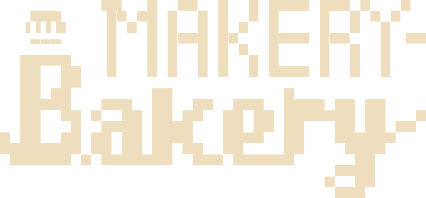
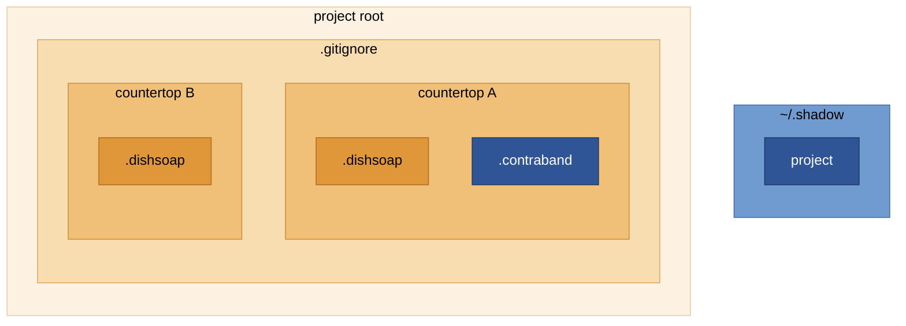

[](https://opensource.org/licenses/MIT)
[](https://github.com/salomepoulain/makery-bakery/releases)
[](https://github.com/salomepoulain/makery-bakery/search?l=sh)
[](https://github.com/pre-commit/pre-commit)

> A modular kitchen for your project's development environment.

- [Why this exists](#why-this-exists)
- [The bakery metaphor](#the-bakery-metaphor)
- [Getting started](#getting-started)
- [Core commands](#core-commands)
- [Security and reproducibility](#security-and-reproducibility)
- [The kitchen, as a set of nested regions](#the-kitchen-as-a-set-of-nested-regions)
- [Going shady](#going-shady)
- [Bake vs. make](#bake-vs-make)
- [Station structure](#station-structure)
- [Creating new stations](#creating-new-stations)
- [Contributing](#contributing)
- [Development setup](#development-setup)

## Why this exists

A project splits into two piles. The part that ships to GitHub, and everything else: local caches a Makefile clears out, folders symlinked to a synced drive so they follow you between machines, and the recurring setup rituals you run for a given kind of project (the right Python env, a specific shell on a cluster, only the Claude skills that project needs). None of that belongs in the repo, but you don't want to hand-copy it into every new project either.

`makery-bakery` is a declarative scaffolding system built on `make` for exactly that space. Instead of copying Makefiles and setup scripts between projects, you hire specialized workers, called Stations (more on those below), that set up an environment and expose the tasks that go with it. A package manager for boilerplate, with personality.

## The bakery metaphor

Your project is the kitchen. GitHub is the guest, served only what leaves the kitchen.

- `makery/` (no dot) is the tracked payload in this repo: the master copy of the Head Chef and every Station template.
- `.makery/` (note the dot) is the runtime kitchen `bake` extracts into *your* project. It's gitignored, nobody but you ever sees it.
- The **Head Chef** (`.makery/headchef`) is the orchestrator: it hires Stations, routes commands, and cleans up after them.
- A **Station** is a workspace where one specialized **Cook** works. Each Station brings its own dependencies and exposes its tasks as **skills** (`cook/skills/*.sh`).
- You **hire** a Station with `bake first <name>`, and **fire** one with `bake burnt <name>`.
- Each Station's **workbench** defines its footprint:
  - `.tools`: system commands the Head Chef checks for before hiring.
  - `.countertop`: the sole source of truth for `.gitignore`. Written by hand, never auto-merged, so a Station author has to think about what leaves the kitchen.
  - `.dishsoap`: caches and local mess. `bake germs` scrubs it.
  - `.contraband`: files that get stashed on top of being gitignored, physically moved out to `~/.shadow/` by `bake shady`, covered under [Going shady](#going-shady).

## Getting started

There are two installation paths: one for `bake` users, one for `make` users.

### Path A: using `bake` (recommended)

1. **Install the `bake` command globally, once:**
   ```bash
   curl -sSL https://github.com/salomepoulain/makery-bakery/releases/latest/download/install_bake.sh | bash
   ```
   This writes a single self-contained binary to `~/.local/bin/bake`, with the makery payload embedded inside it. No global `~/.makery/` directory, no other state. The installer is published as a release asset versioned alongside the tarball it installs, so you can pin a tag for a reproducible install.

2. **In any project folder, just run `bake`:**
   ```bash
   bake
   ```
   On first use it extracts the embedded payload into `./.makery/`. Later runs skip extraction and route straight to `make`. Your project's `Makefile` stays untouched.

**Upgrading:** re-run the same `curl | bash` command. It overwrites `~/.local/bin/bake` with the latest payload. Existing projects keep their own `.makery/`; new projects get the new one.

Every time you run bare `bake` with no arguments, in any project, new or existing, it checks GitHub for a newer release and offers to pull it in (both for this project's `.makery/` and for your global binary, asked separately). Set `BAKE_NO_UPDATE_CHECK=1` to skip that check.

### Path B: using `make` directly

```bash
# 1. Clone makery-bakery temporarily
git clone --depth 1 https://github.com/salomepoulain/makery-bakery.git .makery-temp

# 2. Set up the kitchen (creates a Makefile with makery hooks)
bash .makery-temp/install/install_make.sh

# 3. Clean up
rm -rf .makery-temp
```

Run this in each project where you want makery installed. It mirrors `makery/` into `.makery/` and either creates a `Makefile` with makery includes or appends the hooks to your existing one.

Now use `make` directly:
```bash
make first s=python        # Hire the python station
make call s=python d=test  # Run a skill from a station
make germs s=python        # Scrub the python workbench
make germs                 # Scrub every workbench
make burnt s=python        # Fire the python station
```

## Core commands

- `bake`: show the menu (bootstraps `.makery/` on first use in a project).
- `bake inspo`: list Stations available in the registry.
- `bake first <name>`: hire a Station and run its onboarding.
- `bake burnt <name>` / `bake last <name>`: fire a Station and undo its leftovers. `last` is a plain-language alias, same command either way.
- `bake germs [name]` / `bake clean [name]`: scrub a Station's dishsoap mess, or every hired Station's if no name is given. `clean` is the plain-language alias for `germs`.
- `bake station <name>`: scaffold a new Station from the `_empty_station` template.
- `bake shady [path]`: no path stashes every hired Station's contraband; a path stashes just that one thing.
- `bake request`: open a PR with your local Station updates against the registry.
- `bake all`: fire every Station and delete the entire project directory, not just `.makery`. Only what already went shady survives. See the warning under [The kitchen, as a set of nested regions](#the-kitchen-as-a-set-of-nested-regions).

`bake` routes commands automatically: core operations take a Station name directly (`bake first python`), while a Station's own skills go through `call` (`bake python test` → `make call s=python d=test`).

## Security and reproducibility

You just ran a `curl | bash` command, so here's what it actually does and how to check it yourself.

- `install_bake.sh` downloads a release tarball and verifies its SHA256 before embedding it. The tarball contents are then frozen inside your `bake` binary.
- Inspect `install/install_bake.sh` and the resulting `~/.local/bin/bake` before running if you want to audit what the installer does.
- Pin a specific release tag rather than `latest` for a reproducible install.

Each release publishes:
- `makery-bakery-<tag>.tar.gz`: the makery payload (the `makery/` folder, unprefixed)
- `makery-bakery-<tag>.tar.gz.sha256`: its checksum
- `install_bake.sh`: the installer, with the payload embedded at build time

Manual verification:

```bash
TAG=v0.1.0
curl -sSL -O https://github.com/salomepoulain/makery-bakery/releases/download/$TAG/makery-bakery-$TAG.tar.gz
curl -sSL -O https://github.com/salomepoulain/makery-bakery/releases/download/$TAG/makery-bakery-$TAG.tar.gz.sha256
sha256sum -c makery-bakery-$TAG.tar.gz.sha256
```

Releases are date-versioned and published directly by the maintainer with `bake release`, no CI workflow is involved: it tags `main`, builds the tarball and checksum from `makery/`, and pushes a GitHub Release with all three assets in one step.

## The kitchen, as a set of nested regions

That covers running the tool. The rest of this section is what `.gitignore`, `.countertop`, `.dishsoap`, and `.contraband` actually do to your filesystem, and which command touches which one.

Everything git doesn't track falls under `.gitignore`, and that region is a union: every hired Station contributes its own `.countertop`, plus whatever lines got written into `.gitignore` by hand. Each Station's `.countertop` in turn contains its `.dishsoap`, and optionally a `.contraband` slice. Both have to be listed in `.countertop` too, nothing here is auto-derived. A Station author writes each file by hand and duplicates entries on purpose.

`.contraband` doesn't stop at being gitignored, `bake shady` moves it further out still, into `~/.shadow/` in the diagram below. That mechanism is [Going shady](#going-shady), covered right after this section.

Here's that structure drawn out: orange for how far a file sits from git, blue for what physically leaves the project.



The deeper the orange, the further from git. The pale outer box is the project root, next is everything `.gitignore` hides, then each Station's countertop, and the darkest boxes are the files themselves. `~/.shadow` sits outside the project root entirely, never touching it. The two blue boxes are a pair: `.contraband` is what leaves, `project` is where it lands. That move is covered under [Going shady](#going-shady).

`__trash__` sits outside this whole hierarchy on purpose: a plain local scratch folder. `bake` creates it empty the moment it bootstraps a project, alongside `.makery/` (Path A only, `install_make.sh` doesn't), but no command reads, cleans, or syncs it afterward.

| Command | Region it touches | What happens |
|---|---|---|
| `bake germs [name]` / `bake clean [name]` | one Station's `.dishsoap`, or every hired Station's | Deletes the listed paths. |
| `bake shady [path]` | one Station's `.contraband`, or every hired Station's | Moves the listed paths (or just `path`) into `~/.shadow/projects/<project>/`, leaves a `__stash__` symlink, records it in the ledger. |
| `bake burnt <name>` / `bake last <name>` | the whole Station's `.countertop` | Runs `fired.sh`, then clears every path in `.countertop`, which already covers `.dishsoap` (that's why it's listed there too), then deletes the Station directory. |
| `bake first <name>` | `.countertop` (+ auto-restash) | Appends the Station's countertop entries to `.gitignore`; if the project already went shady, re-runs `bake shady` so the new Station's contraband is covered too. |
| `bake all` | the entire project directory, everything under `ROOT`, except `__stash__`'s target | Fires every Station, then deletes the project root itself, not just `.makery`. See the warning below. |
| `git` / GitHub | everything outside `.gitignore` | The complement of `KITCHEN` in the diagram above, not a subset of it. |

> [!WARNING]
> `bake all` does not just tear down `.makery`. After firing every Station it runs `rm -rf` on the **project root itself**, git history and all. The only reason anything survives is that `.contraband` was physically moved out to `~/.shadow/` by `bake shady`, `rm -rf` on the `__stash__` symlink only removes the link. `bake all` asks for a `y/N` confirmation first, but say yes and there's no undo.
>
> It also doesn't clean up after itself in `~/.shadow/`. Once the project is gone, `~/.shadow/projects/<project>/` is an orphan nothing points at anymore, `bake all` never deletes it. If you're done with a project for good, `rm -rf ~/.shadow/projects/<project>/` is on you.

## Going shady

Some files need to travel with you across machines without ever touching git: personal notes, local settings, an API key you don't want to re-type. That's what `bake shady` is for.

Running it moves everything listed in every hired Station's `.contraband` out of the repo and into `~/.shadow/projects/<project>/` (override with `MAKERY_SHADOW_DIR`), leaving a `__stash__` symlink behind. That symlink is the sync entrypoint: it's the one local pointer into everything this project has ever stashed, so pointing something like OneDrive or Syncthing at `~/.shadow/` is what carries the real files between machines. A `.ledger` file in the stash tracks which paths are supposed to be symlinks, so re-cloning the repo or syncing `~/.shadow/` in from another machine reconnects everything automatically, no glob-matching required. `bake shady "<path>"` stashes one specific path instead, for anything a Station's `.contraband` doesn't already cover.

A Station can react to going shady with an optional `cook/contract/illegal.sh`, useful when stashing a folder alone isn't enough and a tool's own config needs to point at the new location.

This is separate from `__trash__`, which is just an unmanaged local scratch folder. Nothing moves it, nothing syncs it.

## Bake vs. make

Getting started already covered installing and running either one. This section is the mapping between them, for wiring makery targets into your own `Makefile`, or just seeing what `bake` actually runs under the hood.

### Option A: `bake` (recommended for most users)

`bake` reads its own `.makery/menu.mk` and leaves your project's `Makefile` untouched, so it can be committed without any makery modifications.

- `bake first python` → `make -f .makery/menu.mk first s=python`
- `bake python test` → `make -f .makery/menu.mk call s=python d=test`

### Option B: `make` directly

Add these lines to your `Makefile` if you want makery targets integrated into your own build:

```makefile
.PHONY: menu first burnt germs fresh all call

-include .makery/headchef/menu.mk
-include .makery/stations/*/menu.mk
```

Then use `make first s=python` and `make call s=python d=test` directly.

## Station structure

Everything above is for using a Station someone else built. From here on it's about building one: what files a Station needs, and how the Head Chef expects them laid out.

A Station is a regular Makefile with explicit targets and comments. It works standalone: `cd` into the Station directory and run `make <skill>`.

```
station-name/
├── menu.mk                   # Makefile with a menu:: target and skill targets
├── cook/
│   ├── personality.sh        # Cook identity (icon, name, color)
│   ├── contract/
│   │   ├── hired.sh          # Runs once when the Station is hired
│   │   ├── fired.sh          # Runs once when the Station is fired
│   │   └── illegal.sh        # Optional: runs when the project goes shady
│   └── skills/
│       └── example.sh        # A skill (bake call s=<name> d=example)
└── workbench/
    ├── .tools                # Required system tools, checked before hiring
    ├── .countertop           # This Station's .gitignore entries, by hand
    ├── .dishsoap             # Paths/caches deleted by bake germs
    ├── .contraband           # Paths stashed by bake shady
    └── pantry/               # Files this Station stores or ships, unpacked by hired.sh
```

If a skill needs to move, store, or unpack files, `workbench/pantry/` is where they live. Nothing copies pantry contents out automatically, a Station's own `hired.sh` decides what gets unpacked and where.

Published reference: `salomepoulain/makery-stations`.

## Creating new stations

Stations live in a registry, `salomepoulain/makery-stations` by default. Run `bake station <name>` to scaffold one from `.makery/stations/_empty_station`, this shells out to the GitHub API and needs `gh auth login`.

### Writing a Station's `menu.mk`

```makefile
# station-name/menu.mk
# Standalone Makefile — works with: cd .makery/stations/<name> && make <skill>

STATION_DIR := $(dir $(lastword $(MAKEFILE_LIST)))

menu::
	@bash -c 'source "$(STATION_DIR)cook/personality.sh" && STARTER "$$COOK_NAME'\''s Menu" && \
		ITEM "<<example>>" "<<Description of the skill>>" && \
		LINE'

# Add your skills below:

example:
	@bash $(STATION_DIR)cook/skills/example.sh
```

The `menu::` double-colon target appends to the Head Chef's own `menu::`, so `bake menu` shows your Station's section after the core commands. `hired.sh`, `fired.sh`, and `illegal.sh` are lifecycle scripts the Head Chef runs directly, they never belong in `menu.mk` as Make targets.

Each Station needs:
- `menu.mk` (copy from `_empty_station`, rename, add skill targets),
- `cook/contract/hired.sh` and `fired.sh` for setup and teardown,
- `cook/contract/illegal.sh` if it needs to react to going shady (delete it otherwise),
- `workbench/.tools` for required system commands,
- `cook/skills/` for the skill scripts,
- `cook/personality.sh` with the Station's icon, name, and color,
- `workbench/.countertop`, `.dishsoap`, and `.contraband`.

## Contributing

To add a Station:
1. Follow the Station template.
2. Run `bake request` to open a PR against `salomepoulain/makery-stations` with your local Station updates.
3. For changes to the Head Chef itself, `bake request` opens the equivalent PR against this repo.

Merging sync PRs (`bake in`) and cutting releases (`bake release`) require maintain/admin rights on both repos and are restricted to the project owner. Neither shows up in `bake menu` or [Core commands](#core-commands): they're maintenance operations on this repo and the registry, not something a Station user or author ever runs.

## Development setup

[pre-commit](https://pre-commit.com/) lints shell scripts before commit:

```bash
# One-time setup
pip install pre-commit
pre-commit install

# Install shellcheck (if not already installed)
# macOS: brew install shellcheck
# Ubuntu: sudo apt install shellcheck
```

`.pre-commit-config.yaml` runs `shellcheck` on every staged `*.sh` file.
